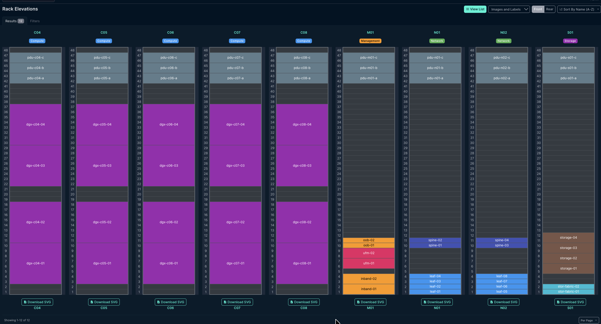
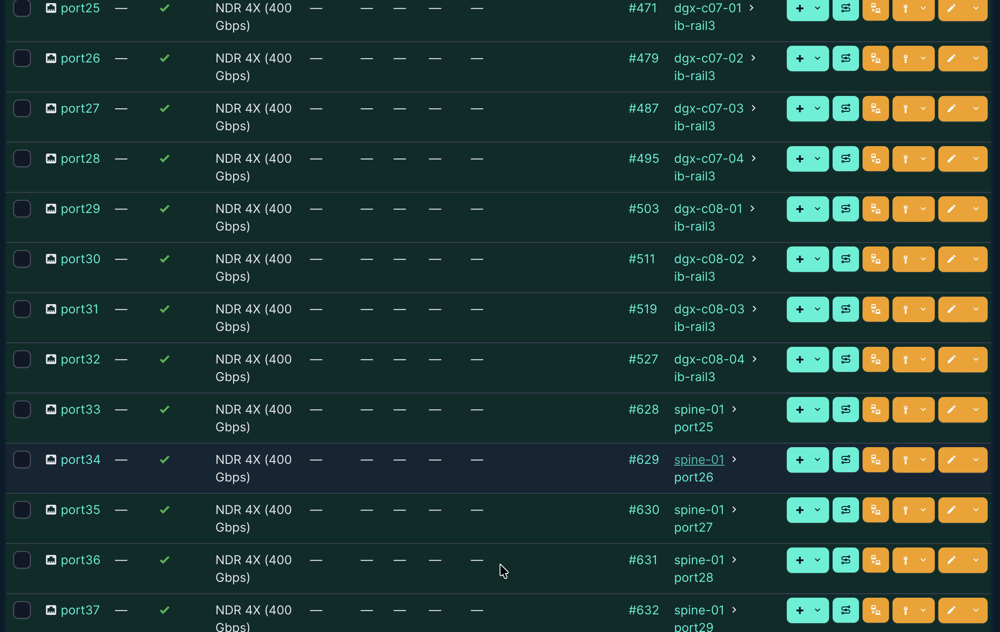
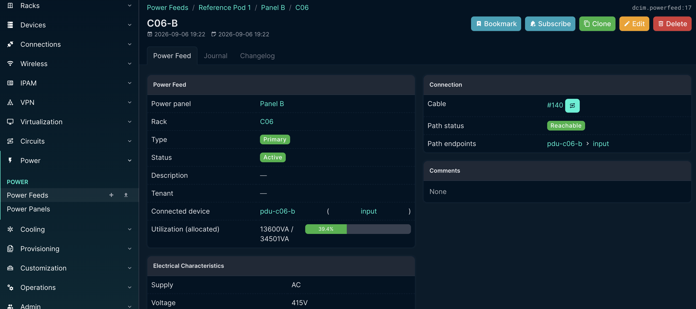
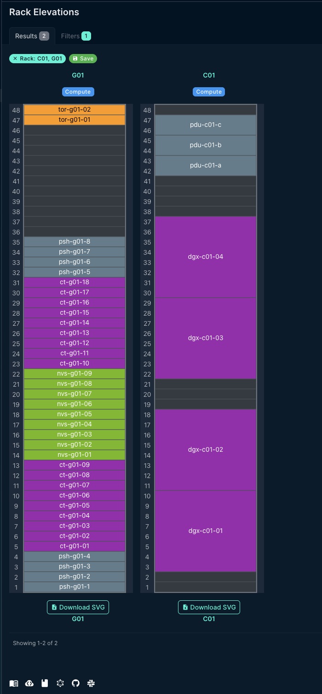
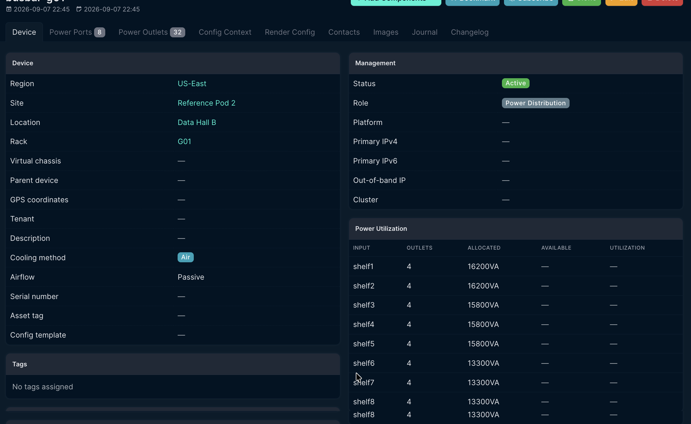
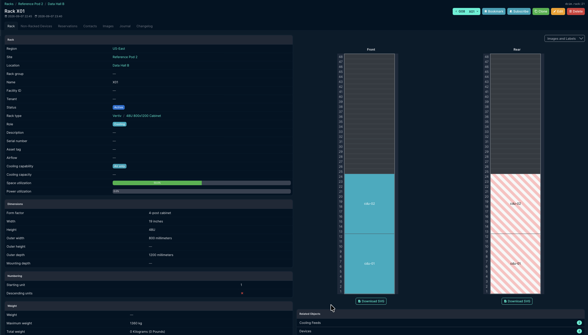

# Reference GPU Pod — DCIM Model & Commissioning Package

[](https://github.com/patjenkinsGIT/netbox-gpu-pod/actions/workflows/build.yml)

*Every push rebuilds both pods from an empty NetBox, re-runs the exports, and
asserts the figures quoted below. The badge is the claim that the numbers on
this page are reproduced rather than remembered.*

NetBox models of **two NVIDIA DGX SuperPOD scalable units**, built from published
reference architecture, with one generator that reproduces either from a YAML spec:

| Site | Design | Spec |
|---|---|---|
| **Reference Pod 1** | 32× DGX H100, air-cooled, 12 racks, 359.6 kW | `spec/pod.yaml` |
| **Reference Pod 2** | 8× GB200 NVL72, liquid-cooled, 9 racks, 977.2 kW | `spec/pod-gb200.yaml` |

> **Scope honesty.** This is a design and documentation exercise: a paper model of a
> published reference architecture. Nothing here was deployed or operated, and it is
> not affiliated with NVIDIA. Figures are labelled **sourced** or **assumed**
> throughout, and the distinction is kept deliberately visible.

**Status: both pods converge.** 21 racks, 406 devices, 1,314 cables, 1,336.8 kW.
Each rebuilds from its own spec by running one script, and a run over either
reconciles the objects they share to identical values.



*Compute racks repeat NVIDIA's published profile — rPDUs at U42–47, DGX at U30, U22,
U11 and U3, with the 3U airflow gap at U19–21. N01/N02 hold the eight leaf and four
spine switches, M01 the UFM pair and management fabric, S01 the storage nodes.*

---

## What's here

| Path | Contents |
|---|---|
| `spec/pod.yaml` | Air-cooled H100 pod — the desired end state |
| `spec/pod-gb200.yaml` | Liquid-cooled GB200 NVL72 pod |
| `scripts/build_pod.py` | Idempotent generator; reconciles NetBox against a spec |
| `scripts/netbox_client.py` | Shared connection helper (handles both NetBox auth schemes) |
| `scripts/check_connection.py` | Preflight — verifies reachability and **write** scope |
| `scripts/show_choices.py` | Prints the type slugs the live instance accepts |
| `scripts/show_cooling.py` | Prints NetBox 4.7's cooling model as this instance serves it |
| `scripts/clear_busbar_cables.py` | Narrow deletion tool — the generator never deletes |
| `scripts/export_reports.py` | Power reports, cable schedules, rail map, cooling, comparison |
| `docs/design-notes.md` | What is sourced, what is a choice, what is a guess |
| `docs/methodology.md` | How the generator got from get-or-create to reconciling |
| `docs/roadmap.md` | What is done, what is left, and what was rejected |
| `docs/commissioning-checklist.md` | Site readiness through handover |
| `exports/` | Generated CSVs, one set per pod, plus `pod-comparison.csv` |
| `env-example/` | `.env` and compose override to copy into `netbox-docker/` |

---

## Running it

```bash
git clone https://github.com/netbox-community/netbox-docker.git
cp env-example/.env env-example/docker-compose.override.yml netbox-docker/
cd netbox-docker && docker compose up -d
docker compose exec netbox /opt/netbox/venv/bin/python /opt/netbox/netbox/manage.py createsuperuser
```

NetBox comes up on <http://127.0.0.1:8000/> — bound to loopback deliberately, since
the upstream example publishes on all interfaces. Pinned to NetBox **v4.7** via
netbox-docker **5.1.0**, Postgres 18, Valkey 9.1.

Then create an API token in the UI and:

```bash
python3 -m venv .venv && source .venv/bin/activate
pip install -r requirements.txt
printf 'NETBOX_URL=http://127.0.0.1:8000\nNETBOX_TOKEN=<your token>\n' > .env
python scripts/check_connection.py
python scripts/build_pod.py --dry-run
python scripts/build_pod.py
```

For the liquid-cooled pod, point it at the other spec:

```bash
python scripts/build_pod.py --spec spec/pod-gb200.yaml --dry-run
python scripts/build_pod.py --spec spec/pod-gb200.yaml
python scripts/export_reports.py
```

`build_pod.py` is idempotent — run it as often as you like. It reads current state
fresh each time rather than tracking what previous runs did, so an interrupted run
is fixed by running it again, with no cleanup step. The two specs live in separate
sites and share a region and several device types; running either reconciles those
shared objects to the same values, which is a check on both files.

---

## Reference Pod 1 — the air-cooled SU

12 racks in one scalable unit:

| Racks | Role | Contents |
|---|---|---|
| C01–C08 | Compute | 4× DGX H100 at U3/U11/U22/U30, 3× rPDU at U42/44/46 |
| N01–N02 | Network | 8× QM9700 compute leaf, 4× spine, storage fabric |
| M01 | Management | UFM pair, SN4600C in-band, SN2201 out-of-band |
| S01 | Storage | Storage nodes and storage fabric leaf |

### Sourced figures

| | Value | |
|---|---|---|
| DGX H100 | 8U, 10.2 kW, 130.45 kg, 6 PSUs in 4+2 | [user guide][dgx] |
| | 8× NDR400 InfiniBand per system | [components][comp] |
| Scalable unit | up to 32 DGX H100; 8 leaf + 4 spine | [architecture][arch] |
| Rack density | 4 systems/rack → >40 kW/rack | [architecture][arch] |
| Racks | EIA-310, ≥48U, 800×1200 mm recommended | [electrical][elec] |
| Power scheme | 415 VAC, 60 A, 3-phase, N+1, ≥3 sources/rack | [electrical][elec] |
| | each source sized for 50% of peak load | [electrical][elec] |
| QM9700 | 1U, 64× NDR400, 747 W passive / 1720 W active | [QM97x0 specs][qm] |
| SN4600C | **2U** (88 mm), 64× QSFP28 100GbE, 466 W | [SN4000 specs][sn4] |
| SN2201 | 1U, 48× 1GbE + 4× QSFP28, 98 W | [SN2201 specs][sn2] |
| UFM appliance | 2U (88 mm), 2 PSUs, InfiniBand + OOB ethernet | [UFM specs][ufm] |
| Rack profile | servers from U3, 3U airflow gap, horizontal rPDUs at top | [infrastructure][infra] |

### Assumed, not sourced

Storage node model and count, the 2 storage + 2 in-band NICs per DGX, SN2201 dual PSU,
UFM power draw, rPDU height, and all cable lengths. Full list with reasoning in
**[docs/design-notes.md](docs/design-notes.md)**.

That file also separates what NVIDIA *prescribes* from what it explicitly leaves open.
The compute side is specified in detail; the management-rack figure carries the caveat
that "sizes and quantities will vary depending upon models used." The infrastructure
choices here are choices, and are labelled as such rather than presented as conformance.

---

## Design decisions

Fuller reasoning, and the line between what NVIDIA specifies and what it leaves open,
in **[docs/design-notes.md](docs/design-notes.md)**.

**Leaf switches end-of-row, not top-of-rack.** Rail-optimised topology requires rail
*n* from all 32 nodes to land on the same leaf, which makes ToR structurally
impossible. This is also what brings the 30 m InfiniBand guidance into play.



*Rail-optimised, made concrete. Every one of leaf-04's 32 downlinks is some node's
`ib-rail3` — `dgx-c08-04` on port 32, seven racks away from `dgx-c01-01` on port 1.
Uplinks start immediately at port 33, so all 64 ports are consumed: 32 down, 32 up.*

**QM9700 budgeted at 1720 W, not 747 W.** NVIDIA publishes 747 W *with passive
cables*; end-of-row placement exceeds passive copper reach, so this pod runs optical
and the active-cable maximum is the honest number. The topology decision propagates
directly into the power budget.

**Three power sources per rack, not an A/B pair.** Four DGX H100 at peak draw
**40.8 kW**, but no single circuit option in NVIDIA's table exceeds 32.8 kW. That gap
is why the guide specifies a minimum of three sources at 50% sizing rather than two.

**800 mm cabinets, not the 600 mm minimum.** With 8 NDR400 rails per node plus
storage, in-band, out-of-band and three power feeds, 600 mm is impractical — and 800
is NVIDIA's own recommendation.

**Power modelling rule.** `allocated_draw` = total ÷ PSU count (normal operation);
`maximum_draw` = total ÷ PSUs required (worst case). For the DGX H100's 4+2 that is
1700 W and 2550 W per supply. Budget against allocated; size circuits against maximum.

**UFM InfiniBand ports left uncabled.** A strictly 1:1 non-blocking fabric consumes
every port — 32 down and 32 up per leaf, and 8 leaves × 8 links fills all 64 spine
ports — so there is nowhere to attach a management appliance. Real deployments reserve
fabric ports for this at the cost of slight oversubscription. Inventing a free port
would have produced a model that looks complete while quietly breaking the property
the topology exists to provide.

---

## Results — Reference Pod 1

From `exports/h100-*.csv`, regenerated by `scripts/export_reports.py`:

| | |
|---|---|
| Pod load | **359.6 kW**, 91% of it GPU |
| Compute rack, steady state | 13,600 VA of 34,501 VA per feed — **39.4%** |
| Compute rack, one source lost | 20,400 VA per feed — **59.1%**, **N−1 PASS** |
| Network racks | ~10% — the fabric is not the constraint |
| Cables | 970, none exceeding the 50 m optical limit |
| Rail map | 8 rails, one leaf each, 32 nodes each — **all PASS** |



*One of C05's three feeds. 13,600 VA drawn of 34,501 VA available — computed by NetBox
from the actual cable path: feed → rPDU input → outlet → PSU.*

**The N−1 figure is the validation.** On loss of one of three sources each survivor
carries **20.4 kW** — NVIDIA's published peak-server-demand-per-circuit figure, reached
independently by walking the model's own cable topology rather than copied from the
document.

**One discrepancy, reported rather than smoothed over:** NetBox computes the
415 V / 60 A three-phase feed at **34,501 VA**; NVIDIA's electrical table lists the
same circuit at **32.7 kW**. About 5%, from a different derating assumption. It does
not change the N−1 verdict — every rack passes against either figure — but it should
be resolved against a facility's own standard before anything is ordered.

---

---

## Reference Pod 2 — the liquid-cooled SU

8× **GB200 NVL72** plus a CDU rack, in a separate site so the air-cooled pod
stays intact as the reference. 314 devices, 344 power cables, and a three-tier
cooling topology built on NetBox 4.7's native cooling objects.



*The same 48U cabinet, the same Compute rack role. C01 holds four 8U DGX H100 —
32 GPUs at 40.8 kW — with the 3 RU airflow gap at U19–21 that NVIDIA's published
rack profile specifies. G01 holds 18 one-rack-unit compute trays, nine NVLink
switch trays and eight power shelves: 72 GPUs at 119.7 kW. G01's layout is
**invented**, because NVIDIA lists what an NVL72 contains and never says where
any of it sits — the free band at U36–46 is a consequence of that, not a
design feature. The one thing both racks do agree on is management at the top:
C01's rPDUs at U42/44/46, G01's ToR switches at U47/48.*

From `exports/pod-comparison.csv`. **Compute racks only** — Pod 2 has no network
or management racks modelled yet, so a whole-pod count would flatter it:

| | H100 | GB200 | |
|---|---|---|---|
| GPUs | 256 | **576** | 2.25× |
| GPUs per compute rack | 32 | **72** | 2.25× |
| kW per compute rack | 40.8 | **119.9** | 2.94× |
| kW per GPU | 1.275 | 1.665 | 1.31× |
| Compute racks per 1,000 GPUs | 31.2 | **13.9** | 0.45× |
| Feeds per compute rack | 3 | 8 | 2.67× |
| Redundancy | N+1, three sources at 50% | N+N, two sides at 100% | |
| Worst surviving feed | 59.1% | **86.7%** | 1.47× |

**The headline is the trade, not the density.** The same GPU count needs 56%
fewer racks and 31% more power to run them — the energy is concentrated, not
saved — while the electrical margin after the worst credible loss narrows from
59% to 87%.

### What changes in the power model

**AC/DC conversion moves into the rack.** Pod 1 is feed → rPDU → outlet → PSU.
The NVL72 is feed → power shelf → **50 V DC busbar** → tray: four hops, and the
tray has no PSU redundancy of its own because all of it moved upstream.

**A busbar is not a tree.** NetBox models power as one-to-one cables; a busbar
is one shared plane that eight shelves push into and twenty-seven trays pull
from. It is modelled as 8 inputs and 32 outlets divided four apiece, and that
division is **fiction** — chosen so the totals aggregate, saying nothing true
about which shelf carries which tray.



*The eight busbar inputs, four trays each. 16,200 / 15,800 / 13,300 VA is as
close as a one-to-one cable tree gets to a shared bus, where every shelf would
carry 14,962 — the residual spread is an artefact of 27 discrete trays not
dividing into 8, not a property of the design. Note the empty **Available** and
**Utilization** columns: the input ports declare no maximum draw, deliberately,
since that is precisely what lets NetBox aggregate what is plugged in. A first
version of the allocator dealt trays round-robin over a name-sorted list and
put 18,700 VA on shelf 1 — a hotspot invented by alphabetical order.*

**So the N+N verdict is asserted, not derived.** Pod 1's 20.4 kW N−1 figure
counted as independent reproduction because NetBox walked the cable path.
Nothing equivalent exists here, and the report says so rather than borrowing
the credibility of the first result.

### What NetBox 4.7's cooling model does and doesn't do

It ships real cooling objects — sources, feeds, and intake/outflow components
that parent exactly like power outlets do. The CDU and rack manifold are built
the same way an rPDU is, and the same silent-failure trap applies.

But it carries **capacity at every level and demand at none**, and there is no
cable or foreign key joining a feed to a device. It will hold a complete,
correct topology and compute nothing from it. Every cooling figure in
`exports/gb200-cooling-report.csv` is therefore derived by this repo from the
power model, and every row carries a `basis` column saying so.

Two of the 226 cooling intakes can never be wired — the CDUs' facility-water
side, where the model has no link to express. The report separates
`unwired_at_plant` from `unwired_unexplained` for that reason.



*X01, holding the two CDUs. **Cooling capability** is set and **cooling capacity
is blank** — NVIDIA publishes no figure, and an invented one produces a PASS
that was never earned; an earlier version set it to the rack's published power
draw and the report duly compared a number against itself. Two cooling feeds
attach here, which is the only association NetBox can express between facility
plant and the equipment it serves. **Power utilisation reads 0.0%** because the
CDUs' 18 kW is one of the named gaps below — it appears in the power report's
`uncabled_w` column rather than being quietly given a circuit that was never
designed.*

### Named gaps

`19,568 W` appears in the power report's `uncabled_w` column: ToR switch power
(NVIDIA says the racks contain them and not what powers them) and CDU power
(no distribution modelled in the CDU rack yet). Network and management racks
and fabric cabling are not modelled, pending sourced switch counts. Full list,
with the much longer GB200 assumption set, in
**[docs/design-notes.md](docs/design-notes.md)**.

---

## Notes on NetBox itself

Two behaviours that cost real time, recorded because they aren't obvious:

**A pass-through power port aggregates downstream load only when both `maximum_draw`
and `allocated_draw` are empty.** Setting `maximum_draw` on an rPDU's input makes
NetBox use the declared value instead of computing from what's plugged in, so the feed
reads 0 VA behind a perfectly healthy "Reachable" cable. Supplying *more* data breaks
the calculation.

**Power outlets must have their parent power port set**, or there is no path from a
device PSU up to the feed. Fails the same silent way. The 4.7 cooling model
repeats this exactly: a cooling outflow parents to a cooling intake the way an
outlet parents to a power port, and an unparented one is just as invisible.

**Rack cooling capability and capacity are inherited from the rack type.** A
per-rack value is accepted, returns 200, and is discarded — so a generator can
report `updated: 1` while nothing changed, and report it again on every run
afterwards. Two racks of the same cabinet model therefore cannot differ in
cooling capacity, even though that depends on what is installed rather than on
the cabinet.

Also worth knowing: the REST API does not expand `[1-64]` name ranges — that is a
UI-form feature only. And NetBox 4.7 issues `nbt_<key>.<token>` credentials requiring
the `Bearer` scheme rather than pynetbox's default `Token`.

[dgx]: https://docs.nvidia.com/dgx/dgxh100-user-guide/introduction-to-dgxh100.html
[comp]: https://docs.nvidia.com/dgx-superpod/reference-architecture-scalable-infrastructure-h100/latest/dgx-superpod-components.html
[arch]: https://docs.nvidia.com/dgx-superpod/reference-architecture-scalable-infrastructure-h100/latest/dgx-superpod-architecture.html
[elec]: https://docs.nvidia.com/dgx-superpod/design-guides/dgx-superpod-data-center-design-h100/latest/electrical.html
[qm]: https://networking-docs.nvidia.com/qm97x0hw/specifications
[sn4]: https://networking-docs.nvidia.com/sn4000hw/specifications
[sn2]: https://networking-docs.nvidia.com/sn2201hw/specifications
[ufm]: https://networking-docs.nvidia.com/ufmenterprisendrhwum/mechanical-installation
[infra]: https://docs.nvidia.com/dgx-superpod/design-guides/dgx-superpod-data-center-design-h100/latest/infrastructure.html
